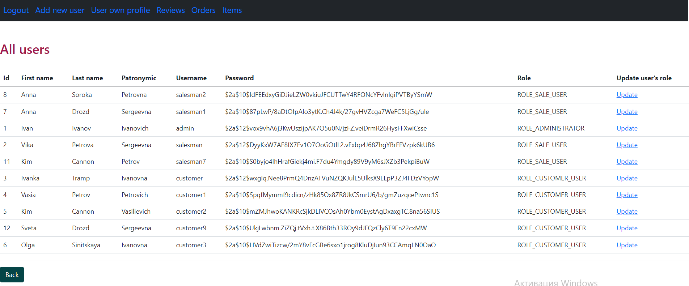

> This is the final course project - an online resource that includes a simple online store. The project uses 3 main roles for users, which respectively have different access and have different capabilities.

* [General information about the project ](#general-information-about-the-project)
* [Technologies ](#technologies)
* [How to build ](#how-to-build)
* [Screenshots ](#screenshots)

## General information about the project

### This application can be used for the following purposes:
- To sell various goods on the Internet;
- Add and change quantity and descriptions of goods;
- Form and track user orders
- Each client can leave their feedback to improve the application.

### Technologies
- Java 
- Maven
- Spring Boot
- Spring Security
- Spring MVC
- Git
- Docker
- Hibernate
- REST
- JSON
- HTML5
- Thymeleaf
- Log4j2
- Postgres
- Apache Pool
- Flyway
- Lombok
- Testcontainers
- JUnit5
- Mockito

### How to build

1. Build project: mvn clean install
2. To run environment: docker-compose up -d
3. To run the project: run 'Application.class'.
4.To authenticate and view user capabilities, you need enter a username and password. 
For simple presentation and protection of the project, the username and password are the same.
for admin : 'admin';
for customer : 'customer';
for salesman : 'salesman'. 

## Screenshots

